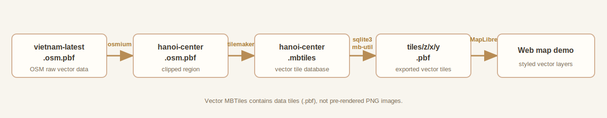
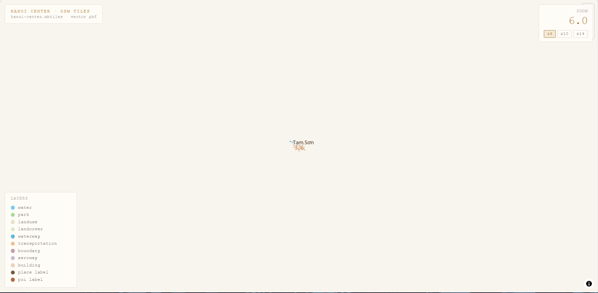
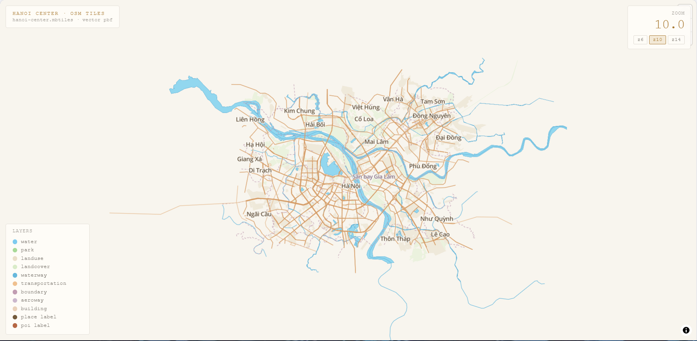
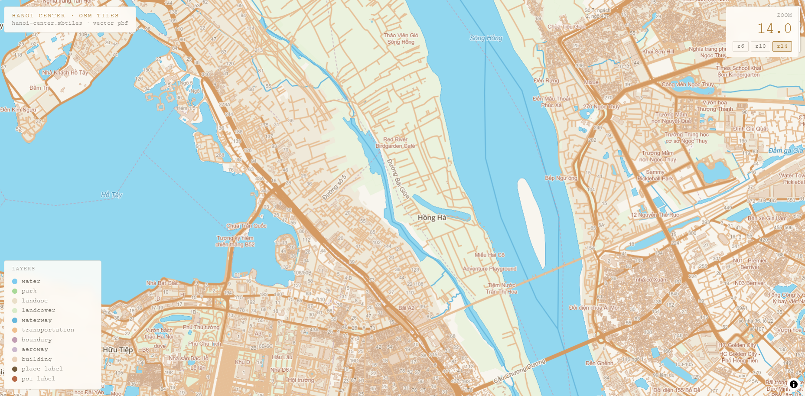

# OSM PBF to Vector MBTiles Demo - Hanoi Center

Demo này minh họa pipeline xử lý dữ liệu bản đồ vector offline từ
OpenStreetMap đến bản đồ hiển thị trên web.

## Scope Chính

- Hiểu file `.osm.pbf` là gì.
- Dùng `osmium` để inspect và cắt dữ liệu theo khu vực.
- Dùng `tilemaker` để chuyển PBF thành vector `MBTiles`.
- Dùng `mb-util` để export MBTiles thành các tile `.pbf` theo cấu trúc `z/x/y`.

Ngoài scope:

- Render PNG hoặc ảnh vệ tinh.
- Xây dựng tile server production.
- Thiết kế style bản đồ hoàn chỉnh như sản phẩm thực tế.

## Pipeline




## Demo Hiện Tại

File `hanoi-center.mbtiles` có:

| Thuộc tính | Giá trị |
| --- | --- |
| Bounds | `105.700000,20.950000,106.000000,21.150000` |
| Center | `105.850000,21.050000` |
| Zoom | `0` đến `14` |
| Tile count | `256` |

Các vector layer trong MBTiles:

```text
place, boundary, poi, housenumber, waterway, transportation,
transportation_name, building, water, water_name, aeroway,
aerodrome_label, park, landuse, landcover, mountain_peak
```

Trang web dùng MapLibre GL để hiển thị các lớp dữ liệu này. Python server
đọc trực tiếp tile từ `hanoi-center.mbtiles`, vì vậy không bắt buộc phải
export ra thư mục `tiles/` trước khi chạy demo.

## Chạy Demo

Yêu cầu: Python 3.

Mở Terminal sau đó chạy lệnh:

```powershell
python serve_map.py
```

Mở trình duyệt:

```text
http://localhost:8080/
```


## File Chính

| File | Vai trò |
| --- | --- |
| `hanoi-center.osm.pbf` | Dữ liệu OSM đã cắt theo khu vực nghiên cứu |
| `hanoi-center.mbtiles` | Vector tiles đóng gói dạng SQLite |
| `serve_map.py` | Server demo đọc tile trực tiếp từ MBTiles |
| `index.html` | Giao diện MapLibre hiển thị bản đồ |
| `commands.md` | Command thực hành theo pipeline |
| `assets/pipeline.svg` | Sơ đồ pipeline |
| `assets/6x.png`, `assets/10x.png`, `assets/14x.png` | Screenshot kết quả ở các mức zoom |

## Vector MBTiles Và Raster MBTiles

`hanoi-center.mbtiles` trong demo này là **vector MBTiles**:

- Tile chứa dữ liệu hình học và thuộc tính, thường có định dạng `.pbf`.
- MapLibre cần style để vẽ đường, nhà, nước, nhãn và POI.
- Có thể thay đổi màu sắc hoặc bật/tắt layer mà không tạo lại ảnh tile.

**Raster MBTiles** thì khác:

- Tile là ảnh đã render sẵn, thường là `.png` hoặc `.jpg`.
- Trình duyệt hiển thị ảnh trực tiếp; không thể style lại từng đường hoặc tòa nhà.
- Ảnh vệ tinh thuộc nhóm raster và cần nguồn ảnh riêng, không tự sinh từ vector OSM.

## Screenshot

Kết quả hiển thị bản đồ tại các mức zoom:

### Zoom 6



### Zoom 10



### Zoom 14


